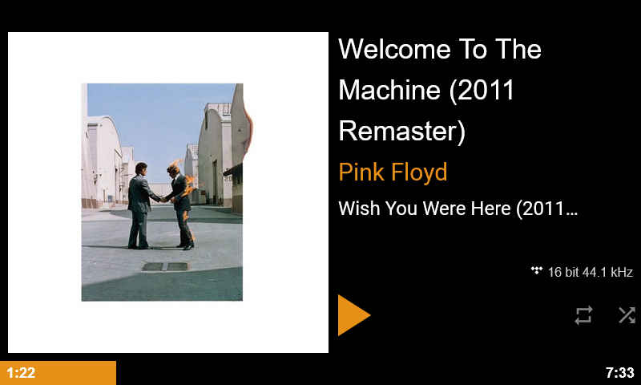

# PHTS NP-01: Now Playing plugin for Volumio

This is a modification of original [volumio-now-playing] which is used by [PHTS NP-01].

Noticeable changes:

- Redesign/reorder player buttons, progress bar, album art, etc
- Render year, bitrate, track number
- Hide all controls on initial screen, leave only default picture, which also changed
- [...and more][commits]

## Install

1. Install "Now PLaying" plugin version 0.3.8
2. Run `scripts\deploy.sh`

## Development

Branch `master` contains latest fixes and improvements onto latest version of the original plugin.

Branch `original` contains original bundled files renamed without hashes. This required for correctly applying diff to new bundled files having always same file name.

Once original plugin's new version published, `master` branch from original repo is merged into `original` branch and update hashed in `deploy.sh` script. Then `original` branch is merged into master with fixing all conflicts.

[volumio-now-playing]: https://github.com/patrickkfkan/volumio-now-playing
[phts np-01]: https://tsaryk.com/NP-01
[commits]: https://github.com/phts/NP-01_now-playing-plugin/commits/master
