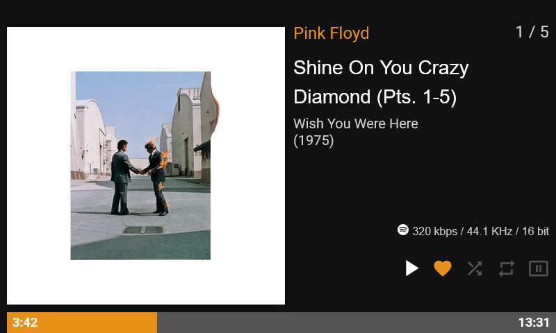

# PHTS NP-01: Now Playing plugin for Volumio

This is a modification of [volumio-now-playing] plugin which is used by [PHTS NP-01].

Tweaks made to [the original repo][volumio-now-playing]:

- Deployment now is just overriding existing plugin on site, so all bundled files are ignored from the repo
- Support "Show clock" options for idle screen config ([patrickkfkan/volumio-now-playing#18](https://github.com/patrickkfkan/volumio-now-playing/pull/18))
- Support manual triggering idle screen when set config `waitTime=0`

## Development

1. Make changes in [NP-01_now-playing-plugin-web-client]
2. Run `scripts/build.sh`
3. Commit updated files

## Deploy

1. Run `scripts/deploy.sh`

[volumio-now-playing]: https://github.com/patrickkfkan/volumio-now-playing
[phts np-01]: https://tsaryk.com/NP-01
[NP-01_now-playing-plugin-web-client]: https://github.com/phts/NP-01_now-playing-plugin-web-client
